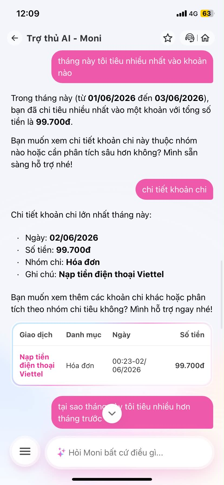
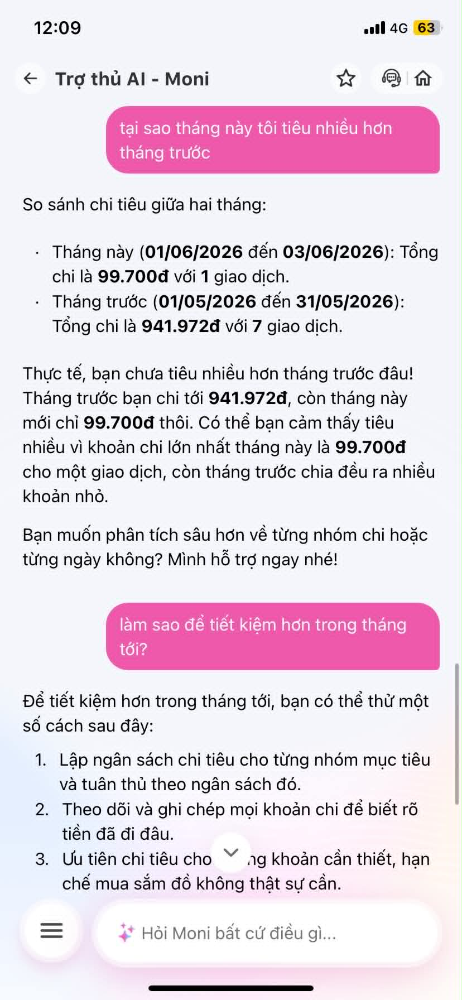
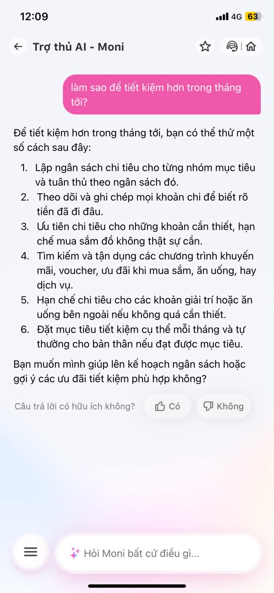

# Workshop — Mổ App AI Thật: MoMo Moni

**Thời gian:** 35-45 phút  
**Hình thức:** cá nhân trước, chia sẻ theo nhóm sau  
**Output:** finding note + sketch `as-is / to-be`

Mục tiêu không phải chấm "UI đẹp hay xấu". Mục tiêu là dùng sản phẩm thật như một bài needfinding: tìm chỗ product gãy trong workflow thật, rồi viết finding đó thành quyết định product.

---

## 1. Chọn một sản phẩm để dùng thử

| Sản phẩm | AI feature | Cách truy cập |
|---|---|---|
| MoMo — Moni | Trợ thủ tài chính, phân tích chi tiêu, chatbot | App MoMo |

**Sản phẩm chọn:** MoMo — Moni  
**Tính năng thử:** Trợ thủ AI - Moni  
**Ngữ cảnh:** Người dùng muốn hiểu chi tiêu trong MoMo và hỏi Moni cách tiết kiệm hơn trong tháng tới.

---

## 2. Dùng thử: Promise vs Reality

### Product hứa gì?

Moni hứa sẽ hỗ trợ người dùng như một trợ thủ tài chính cá nhân: hỏi về chi tiêu, xem giao dịch, so sánh tháng này với tháng trước và gợi ý tiết kiệm.

### User nào được hứa sẽ được giúp?

Người dùng MoMo có giao dịch trong ví, muốn biết mình đã chi gì, chi bao nhiêu và nên làm gì để quản lý tiền tốt hơn.

### Kỳ vọng AI làm được task nào?

- Trả lời khoản chi lớn nhất trong tháng.
- Cho xem chi tiết giao dịch tạo ra khoản chi đó.
- So sánh chi tiêu tháng này với tháng trước.
- Đưa ra kế hoạch tiết kiệm cụ thể dựa trên dữ liệu chi tiêu thật.

---

## Screenshots / Evidence

### Screenshot 1 — Khoản chi lớn nhất trong tháng



**Prompt/input đã thử:**

```text
tháng này tôi tiêu nhiều nhất vào khoản nào
```

**Reality quan sát được:**

Moni trả lời rằng từ **01/06/2026 đến 03/06/2026**, người dùng chi nhiều nhất vào một khoản với tổng tiền **99.700đ**. Khi user hỏi tiếp **“chi tiết khoản chi”**, Moni hiển thị:

- Ngày: **02/06/2026**
- Số tiền: **99.700đ**
- Nhóm chi: **Hóa đơn**
- Ghi chú: **Nạp tiền điện thoại Viettel**

**Đánh giá:** Happy path. Moni lấy được dữ liệu giao dịch thật và hiển thị chi tiết.

---

### Screenshot 2 — So sánh chi tiêu tháng này và tháng trước



**Prompt/input đã thử:**

```text
tại sao tháng này tôi tiêu nhiều hơn tháng trước
```

**Reality quan sát được:**

Moni so sánh hai tháng:

- Tháng này: **99.700đ** với **1 giao dịch**.
- Tháng trước: **941.972đ** với **7 giao dịch**.

Moni kết luận rằng thực tế user **chưa tiêu nhiều hơn tháng trước**. Moni còn giải thích rằng user có thể cảm thấy tháng này tiêu nhiều vì khoản lớn nhất tháng này là **99.700đ** cho một giao dịch, còn tháng trước chia đều ra nhiều khoản nhỏ.

**Đánh giá:** Happy path. Moni sửa được giả định sai của user bằng dữ liệu.

---

### Screenshot 3 — Gợi ý tiết kiệm tháng tới



**Prompt/input đã thử:**

```text
làm sao để tiết kiệm hơn trong tháng tới?
```

**Reality quan sát được:**

Moni đưa ra các lời khuyên chung:

1. Lập ngân sách chi tiêu.
2. Theo dõi và ghi chép khoản chi.
3. Ưu tiên chi tiêu cần thiết.
4. Tận dụng khuyến mãi, voucher, ưu đãi.
5. Hạn chế chi tiêu giải trí hoặc ăn uống bên ngoài.
6. Đặt mục tiêu tiết kiệm cụ thể mỗi tháng.

**Đánh giá:** Low-confidence path. Câu trả lời đúng nhưng chung chung, chưa dùng dữ liệu thật như **99.700đ**, **941.972đ**, nhóm **Hóa đơn**, giao dịch **Nạp tiền điện thoại Viettel** để đề xuất hành động cụ thể.

---

## 3. Vẽ 4 paths

| Path | Câu hỏi cần trả lời | Quan sát trong Moni |
|---|---|---|
| Happy | Khi AI đúng và tự tin, user thấy gì? | Moni trả lời được khoản chi lớn nhất, số tiền, ngày, nhóm chi và ghi chú giao dịch. |
| Low-confidence | Khi AI không chắc, hệ thống có hỏi lại, show options hoặc chuyển người không? | Khi hỏi cách tiết kiệm, Moni đưa lời khuyên chung, chưa show option cụ thể như đặt ngân sách hoặc bật cảnh báo. |
| Failure | Khi AI sai, user biết bằng cách nào và sửa thế nào? | Chưa thấy lỗi sai tính toán lớn. Với câu hỏi có giả định sai, Moni đã sửa lại bằng dữ liệu. |
| Correction | Khi user sửa, correction có được lưu/log/học lại không? | User có thể hỏi tiếp để xem chi tiết, nhưng chưa thấy cơ chế lưu correction nếu user muốn sửa nhóm chi hoặc đặt rule mới. |

---

## 4. Viết finding thành quyết định

### Finding

Khi user hỏi **“làm sao để tiết kiệm hơn trong tháng tới?”**, Moni trả lời bằng lời khuyên chung như lập ngân sách, ghi chép chi tiêu, dùng voucher và hạn chế khoản không cần thiết.

Hậu quả là user biết hướng làm đúng, nhưng chưa biết nên làm gì ngay trong MoMo: đặt ngân sách bao nhiêu, giảm nhóm chi nào trước, bật cảnh báo ở mức nào, hoặc xem lại giao dịch nào.

Lỗi thuộc layer **Data-tool + UX Recovery**. Moni có dữ liệu giao dịch và có khả năng phân tích, nhưng chưa chuyển dữ liệu đó thành hành động cụ thể trong workflow.

### Product Decision

> MoMo Moni nên ưu tiên cải thiện bước **gợi ý hành động sau phân tích**: sau khi phân tích chi tiêu, Moni cần đề xuất ngân sách, cảnh báo và nút thao tác cụ thể dựa trên dữ liệu thật của user, thay vì chỉ đưa ra lời khuyên tiết kiệm chung chung.

---

## 5. Sketch As-Is / To-Be

### As-Is

```text
User mở MoMo
      ↓
User vào Trợ thủ AI - Moni
      ↓
User hỏi: "tháng này tôi tiêu nhiều nhất vào khoản nào"
      ↓
Moni trả lời: 99.700đ
      ↓
User hỏi: "chi tiết khoản chi"
      ↓
Moni hiển thị:
- 02/06/2026
- Hóa đơn
- Nạp tiền điện thoại Viettel
      ↓
User hỏi: "tại sao tháng này tôi tiêu nhiều hơn tháng trước"
      ↓
Moni so sánh:
- Tháng này: 99.700đ / 1 giao dịch
- Tháng trước: 941.972đ / 7 giao dịch
      ↓
Moni sửa giả định sai: tháng này chưa tiêu nhiều hơn
      ↓
User hỏi: "làm sao để tiết kiệm hơn trong tháng tới?"
      ↓
Moni đưa 6 lời khuyên chung
      ↓
Điểm gãy:
User chưa có kế hoạch tiết kiệm cụ thể hoặc nút hành động để làm ngay
```

### To-Be

```text
User hỏi: "làm sao để tiết kiệm hơn trong tháng tới?"
      ↓
Moni kiểm tra dữ liệu chi tiêu gần đây
      ↓
Moni tóm tắt:
- Tháng này: 99.700đ / 1 giao dịch
- Tháng trước: 941.972đ / 7 giao dịch
- Khoản lớn nhất: Nạp tiền điện thoại Viettel 99.700đ
      ↓
Moni đề xuất kế hoạch:
1. Đặt ngân sách tháng tới khoảng 850.000đ
2. Giới hạn nhóm Hóa đơn / điện thoại khoảng 100.000đ - 150.000đ
3. Bật cảnh báo khi tổng chi vượt 70% ngân sách
4. Gợi ý dùng voucher khi thanh toán hóa đơn
      ↓
Moni hiển thị nút:
[Đặt ngân sách tháng tới]
[Bật cảnh báo chi tiêu]
[Xem giao dịch tháng trước]
[Tìm voucher phù hợp]
      ↓
User bấm chọn
      ↓
Moni giúp thiết lập ngay trong app
```

---

## 6. Tự kiểm trước khi nộp

- [x] Có ít nhất 1 screenshot hoặc observation cụ thể.
- [x] Có đủ 4 paths hoặc nói rõ path nào chưa có trong product.
- [x] Finding được viết thành product decision, không chỉ là nhận xét.
- [x] Sketch có as-is và to-be.
- [x] Có một câu nói rõ finding này sẽ đổi gì trong SPEC.

---

## SPEC change

> Sau mỗi câu trả lời phân tích chi tiêu, Moni không chỉ dừng ở việc giải thích dữ liệu mà phải có ít nhất một **next best action** cho user, ví dụ: đặt ngân sách, bật cảnh báo, xem giao dịch liên quan hoặc tìm ưu đãi phù hợp.
